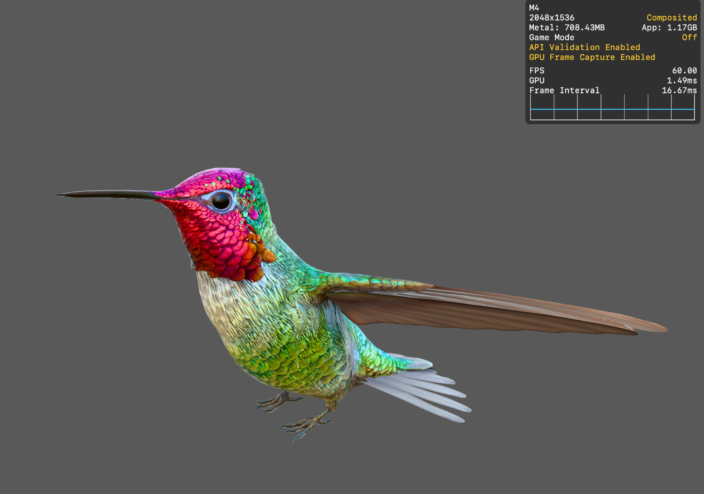

# Paloma Engine

A high-performance 3D game engine built using C++ and Apple's latest Metal 4 API. This project demonstrates advanced rendering techniques including Physically Based Rendering (PBR) and Image Based Lighting (IBL) within a custom Entity-Component architecture.

Based on [metal-4-basics](https://github.com/metal-by-example/metal-4-basics) repo.

## Features

-   **Metal 4 Renderer**: Utilizes the latest Metal GPU driven rendering capabilities (`GPUFamilyMetal4`).
-   **Physically Based Rendering (PBR)**: Realistic lighting model with Albedo, Normal, Roughness, Metalness, and Occlusion mapping.
-   **Image Based Lighting (IBL)**: Environment lighting with diffuse irradiance and specular reflection.
-   **Entity-Component System**: Flexible scene graph with parent-child hierarchy and transform propagation.
-   **USDZ Support**: Native loading of USDZ assets via ModelIO.
-   **Fly Camera**: Free-roaming camera with smooth mouse look and keyboard navigation.
-   **Resource Management**: Efficient texture and mesh loading with caching and residency sets.